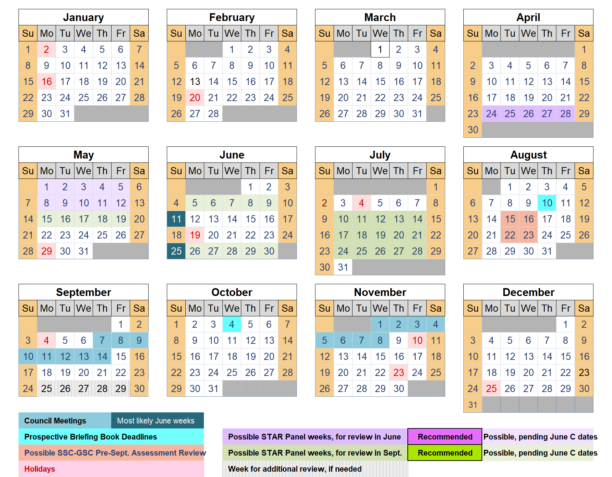

<!--chapter:end:00a.Rmd-->

---
author:
  - name: Chantel R. Wetzel
    code: 1
    first: C
    middle: R
    family: Wetzel
  - name: Jim Hastie
    code: 1
    first: J
    middle: ''
    family: Hastie
  - name: Kristin Marshall
    code: 1
    first: K
    middle: ''
    family: Marshall
author_list: Wetzel, C.R., J. Hastie, K. Marshall
affiliation:
  - code: 1
    address: Northwest Fisheries Science Center, U.S. Department of Commerce, National
      Oceanic and Atmospheric Administration, National Marine Fisheries Service, 2725
      Montlake Boulevard East, Seattle, Washington 98112
---

<!--chapter:end:00authors.Rmd-->

---
bibliography:
  - sa4ss.bib
---

<!--chapter:end:00bibliography.Rmd-->

---
title: Data and analysis supporting the prioritization of species for stock assessments in 2023 and 2025
---

<!--chapter:end:00title.Rmd-->

\pagebreak
\pagenumbering{roman}
\setcounter{page}{1}

\renewcommand{\thetable}{\roman{table}}
\renewcommand{\thefigure}{\roman{figure}}

\setlength\parskip{0.5em plus 0.1em minus 0.2em}

<!--chapter:end:01a.Rmd-->

<!--chapter:end:01executive.Rmd-->

\pagebreak
\setlength{\parskip}{5mm plus1mm minus1mm}
\pagenumbering{arabic}
\setcounter{page}{1}
\renewcommand{\thefigure}{\arabic{figure}}
\renewcommand{\thetable}{\arabic{table}}
\setcounter{table}{0}
\setcounter{figure}{0}

\setlength\parskip{0.5em plus 0.1em minus 0.2em}

<!--chapter:end:10a.Rmd-->

# Introduction

This document provides analysis that is intended to provide the Pacific Fishery Management Council (Council) and advisory bodies guidance on species specific assessment prioritization by synthesizing information by commercial fisheries, recreational fisheries, stock status, and other attributed defined as "Factors".  The work presented here follows the the general framework advanced in the 2015 National Marine Fisheries Service (NMFS) Technical Memorandum, ["Prioritizing Fish Stock Assessments"](https://www.st.nmfs.noaa.gov/Assets/stock/documents/PrioritizingFishStockAssessments_FinalWeb.pdf) [@methot_prioritizing_2015].  

This process was envisioned as a way of synthesizing a broad range of relevant information in a manner that can, over time, provide improved guidance, primarily on which species should be considered for benchmark (i.e., full) assessments, or subsequent stock assessment updates. The ranking process provides a useful tool for focusing discussion on species where a new assessment may have the greatest impact, but it is not a replacement for the judgment of the Council and advisory bodies. An important consideration for selecting any species for assessment is whether the (potentially) available data (e.g., trend and length- and age-composition data) are adequate to conduct the desired level of assessment. This aspect of prioritization is not scored in the way other factors are, and so must be considered independently, at this time.  In that regard, the process is likely to help identify important data gaps and/or situations where a data-moderate approach should be undertaken with whatever data are available.

The scoring and weighting of Factors in the associated Excel workbook remains a work in progress, particularly as we consider its ability, as currently configured, to provide useful insight into priorities in subsequent cycles, as requested by the Council. There may be important considerations that are not encompassed by any of the existing factors, or the methods by which Factor Scores are derived or weighted may be identified as needing improvement.  As consideration of priorities for 2023 are considered this spring it will be important to identify any parts of the scoring that could be improved.  As aspects of management change, this framework should adapt to reflect the manner in which those changes affect prioritization.  

The Excel workbook that accompanies this document begins with an Overview tab, followed by a Summary tab in which the Factor Scores are assembled and multiplied by the base-case weights, resulting in a total score and ranking.  Those are followed by a tab for each Factor, which documents the Factor scores and ranks for each species, and a Summary scoring worksheet. The following text provides a description of the content and issues associated with each tab, along with the source of data and information used in scoring each Factor.

\newpage

<!--chapter:end:11introduction.Rmd-->

# Description of Factors

## Factor Summary

The total scoring combines the scores by species from each Factor using pre-defined weights for each Factor. The total scoring by species is calculated as:
  
\begin{equation}
\begin{aligned}
	\text{F}_s = w_c*c_{s} + w_r*r_{s} + w_t*t_{s} + w_d*d_{s} + w_o*o_{s} + w_b*b_s \\
			 + w_h*h_s + w_e*e_s + w_n*n_s + w_a*a_s
\end{aligned}
\end{equation}

where $w$ is the weight applied to each Factor, $c$ is the commercial importance by species $s$, $r$ is the recreational importance by species $s$, $t$ is the tribal importance by species $s$, $d$ is he constituent demand or choke factor by species $s$, $o$ is rebuilding by species $s$, $b$ is relative stock status by species $s$, $h$ is harvest by species $s$, $e$ is ecosystem importance by species $s$, $n$ is new information available by species $s$, and $a$ is the assessment frequency by species $s$. The weights for each Factor are shown in Table \ref{tab:weights}.

\begingroup\fontsize{10}{12}\selectfont
\begingroup\fontsize{10}{12}\selectfont

\begin{longtable}[t]{l>{\raggedleft\arraybackslash}p{2cm}>{\raggedleft\arraybackslash}p{2cm}>{\raggedleft\arraybackslash}p{2cm}}
\caption{(\#tab:weights)Weights used for each factor in the calculation of total factor score by species.}\\
\toprule
Factor & Notation & Weight Notation & Weight\\
\midrule
\endfirsthead
\caption[]{(\#tab:weights)Weights used for each factor in the calculation of total factor score by species. \textit{(continued)}}\\
\toprule
Factor & Notation & Weight Notation & Weight\\
\midrule
\endhead

\endfoot
\bottomrule
\endlastfoot
Commercial Importance & $c$ & $w_c$ & 0.21\\
Recrational Importance & $r$ & $w_r$ & 0.09\\
Tribal Importance & $t$ & $w_t$ & 0.05\\
Constituant Demand/Choke Species & $d$ & $w_d$ & 0.11\\
Rebuild & $o$ & $w_o$ & 0.10\\
Relative Stock Status & $b$ & $w_b$ & 0.08\\
Harvest Status & $h$ & $w_h$ & 0.08\\
Ecosystem Importance & $e$ & $w_e$ & 0.05\\
New Information Available & $n$ & $w_n$ & 0.05\\
Assessment Frequency & $a$ & $w_a$ & 0.18\\*
\end{longtable}
\endgroup{}
\endgroup{}

<!--chapter:end:21factors.Rmd-->

## Commercial Importance

The commercial importance score is based on the coastwide ex-vessel revenue generated by commercial landings of groundfish during the period 2018 - 2020. The raw revenue amounts generally have a very large range across goundfish species.  Consequently, a transformation is used to compress the distribution and reduce the differences between species.  

As 2-stage logarithmic transformation is used to compress and rescale the distribution, to a high score of 10, using the following approach:

\begin{equation}
  c_{s} = \frac{10}{\text{max}(\text{Revenue}_s)}\text{Revenue}_s^{0.18} 
\end{equation}

where Revenue is the total commercial ex-vessel revenue across the summarizing years for each species $s$. Revenue amounts are retreived from the Pacific Fisheries Information Network (PacFIN). Revenue amounts included in this scoring do not include sales of Tribally-caught groundfish. Those are included in a separate Tribal calculation. 

<!--chapter:end:22commercial_importance.Rmd-->

## Tribal Importance

West Coast groundfish species are highly important to northwest coastal Tribes. The Subsistence category identified in the NMFS guidance document [@methot_prioritizing_2015] was expanded to include the value of Tribal fishing for both commercial sale and subsistence and ceremonial uses. The Tribal Importance Factor is calculated as:
  
\begin{equation}
t_{s} = \frac{\alpha}{\text{max}(\text{revenue}_{s})} \text{revenue}_{s}^{0.18} + \beta_s    
\end{equation}
  
where $\text{revenue}_s$ is the revenue based on ex-vessel prices by species $s$, $\alpha$ is the initial factor score set equal to 7.0 and $\beta_s$ is the subsistence score by species $s$ (Table \ref{tab:sub-score}).
  
Commercial revenue from landings by Tribal vessels were obtained from PacFIN. The calculation of the Tribal Importance scores is broken into two parts.  The first component uses revenues and were transformed using the same process described above for commercial and recreational values, except that the maximum for this part of the total score is set to 7.0. The second component of the score (ranging from 0 to 3.0), represents the relative value of groundfish species to Tribal subsistence harvesters (Table \ref{tab:sub-score}).  These species scores were refined through consultation with Tribal representatives.  Continued comments/input from the Tribal community regarding subsistence scores will ensure that the scoring reflect the current prioritization of the Tribal sector. 
  
\begingroup\fontsize{10}{12}\selectfont
\begingroup\fontsize{10}{12}\selectfont

\begin{longtable}[t]{>{\raggedright\arraybackslash}p{8cm}>{}c}
\caption{(\#tab:sub-score)Subsistence score by species. The subsitance score is colored reflecting low to high scores ranging between blue to green, respectively.}\\
\toprule
Species & Score\\
\midrule
\endfirsthead
\caption[]{(\#tab:sub-score)Subsistence score by species. The subsitance score is colored reflecting low to high scores ranging between blue to green, respectively. \textit{(continued)}}\\
\toprule
Species & Score\\
\midrule
\endhead

\endfoot
\bottomrule
\endlastfoot
Arrowtooth flounder & \cellcolor[HTML]{414487}{\textcolor{white}{\textbf{0.0}}}\\
Aurora rockfish & \cellcolor[HTML]{414487}{\textcolor{white}{\textbf{0.0}}}\\
Bank rockfish & \cellcolor[HTML]{414487}{\textcolor{white}{\textbf{0.0}}}\\
Big skate & \cellcolor[HTML]{44BF70}{\textcolor{white}{\textbf{2.5}}}\\
Black rockfish & \cellcolor[HTML]{7AD151}{\textcolor{white}{\textbf{3.0}}}\\
Blackgill rockfish & \cellcolor[HTML]{414487}{\textcolor{white}{\textbf{0.0}}}\\
Blue/Deacon rockfish & \cellcolor[HTML]{44BF70}{\textcolor{white}{\textbf{2.5}}}\\
Bocaccio & \cellcolor[HTML]{414487}{\textcolor{white}{\textbf{0.0}}}\\
Brown rockfish & \cellcolor[HTML]{44BF70}{\textcolor{white}{\textbf{2.5}}}\\
Cabezon & \cellcolor[HTML]{22A884}{\textcolor{white}{\textbf{2.0}}}\\
California scorpionfish & \cellcolor[HTML]{414487}{\textcolor{white}{\textbf{0.0}}}\\
Canary rockfish & \cellcolor[HTML]{7AD151}{\textcolor{white}{\textbf{3.0}}}\\
Chilipepper rockfish & \cellcolor[HTML]{414487}{\textcolor{white}{\textbf{0.0}}}\\
China rockfish & \cellcolor[HTML]{44BF70}{\textcolor{white}{\textbf{2.5}}}\\
Copper rockfish & \cellcolor[HTML]{44BF70}{\textcolor{white}{\textbf{2.5}}}\\
Cowcod & \cellcolor[HTML]{414487}{\textcolor{white}{\textbf{0.0}}}\\
Curlfin sole & \cellcolor[HTML]{414487}{\textcolor{white}{\textbf{0.0}}}\\
Darkblotched rockfish & \cellcolor[HTML]{414487}{\textcolor{white}{\textbf{0.0}}}\\
Dover sole & \cellcolor[HTML]{21908D}{\textcolor{white}{\textbf{1.5}}}\\
English sole & \cellcolor[HTML]{21908D}{\textcolor{white}{\textbf{1.5}}}\\
Flag rockfish & \cellcolor[HTML]{414487}{\textcolor{white}{\textbf{0.0}}}\\
Flathead Sole & \cellcolor[HTML]{414487}{\textcolor{white}{\textbf{0.0}}}\\
Gopher/Black and yellow rockfish & \cellcolor[HTML]{414487}{\textcolor{white}{\textbf{0.0}}}\\
Grass rockfish & \cellcolor[HTML]{414487}{\textcolor{white}{\textbf{0.0}}}\\
Greenspotted rockfish & \cellcolor[HTML]{414487}{\textcolor{white}{\textbf{0.0}}}\\
Greenstriped rockfish & \cellcolor[HTML]{414487}{\textcolor{white}{\textbf{0.0}}}\\
Honeycomb rockfish & \cellcolor[HTML]{414487}{\textcolor{white}{\textbf{0.0}}}\\
Kelp greenling & \cellcolor[HTML]{22A884}{\textcolor{white}{\textbf{2.0}}}\\
Kelp rockfish & \cellcolor[HTML]{414487}{\textcolor{white}{\textbf{0.0}}}\\
Leopard shark & \cellcolor[HTML]{414487}{\textcolor{white}{\textbf{0.0}}}\\
Lingcod & \cellcolor[HTML]{7AD151}{\textcolor{white}{\textbf{3.0}}}\\
Longnose skate & \cellcolor[HTML]{22A884}{\textcolor{white}{\textbf{2.0}}}\\
Longspine thornyhead & \cellcolor[HTML]{414487}{\textcolor{white}{\textbf{0.0}}}\\
Olive rockfish & \cellcolor[HTML]{414487}{\textcolor{white}{\textbf{0.0}}}\\
Pacific cod & \cellcolor[HTML]{7AD151}{\textcolor{white}{\textbf{3.0}}}\\
Pacific ocean perch & \cellcolor[HTML]{2A788E}{\textcolor{white}{\textbf{1.0}}}\\
Pacific sanddab & \cellcolor[HTML]{22A884}{\textcolor{white}{\textbf{2.0}}}\\
Pacific spiny dogfish & \cellcolor[HTML]{414487}{\textcolor{white}{\textbf{0.0}}}\\
Petrale sole & \cellcolor[HTML]{22A884}{\textcolor{white}{\textbf{2.0}}}\\
Quillback rockfish & \cellcolor[HTML]{22A884}{\textcolor{white}{\textbf{2.0}}}\\
Redbanded rockfish & \cellcolor[HTML]{414487}{\textcolor{white}{\textbf{0.0}}}\\
Redstripe rockfish & \cellcolor[HTML]{414487}{\textcolor{white}{\textbf{0.0}}}\\
Rex Sole & \cellcolor[HTML]{22A884}{\textcolor{white}{\textbf{2.0}}}\\
Rock sole & \cellcolor[HTML]{414487}{\textcolor{white}{\textbf{0.0}}}\\
Rosethorn rockfish & \cellcolor[HTML]{414487}{\textcolor{white}{\textbf{0.0}}}\\
Rosy rockfish & \cellcolor[HTML]{414487}{\textcolor{white}{\textbf{0.0}}}\\
Rougheye/Blackspotted rockfish & \cellcolor[HTML]{22A884}{\textcolor{white}{\textbf{2.0}}}\\
Sablefish & \cellcolor[HTML]{7AD151}{\textcolor{white}{\textbf{3.0}}}\\
Sand sole & \cellcolor[HTML]{22A884}{\textcolor{white}{\textbf{2.0}}}\\
Sharpchin rockfish & \cellcolor[HTML]{414487}{\textcolor{white}{\textbf{0.0}}}\\
Shortraker rockfish & \cellcolor[HTML]{22A884}{\textcolor{white}{\textbf{2.0}}}\\
Shortspine thornyhead & \cellcolor[HTML]{414487}{\textcolor{white}{\textbf{0.0}}}\\
Silvergray rockfish & \cellcolor[HTML]{414487}{\textcolor{white}{\textbf{0.0}}}\\
Speckled rockfish & \cellcolor[HTML]{414487}{\textcolor{white}{\textbf{0.0}}}\\
Splitnose rockfish & \cellcolor[HTML]{414487}{\textcolor{white}{\textbf{0.0}}}\\
Squarespot rockfish & \cellcolor[HTML]{414487}{\textcolor{white}{\textbf{0.0}}}\\
Starry flounder & \cellcolor[HTML]{22A884}{\textcolor{white}{\textbf{2.0}}}\\
Starry rockfish & \cellcolor[HTML]{414487}{\textcolor{white}{\textbf{0.0}}}\\
Stripetail rockfish & \cellcolor[HTML]{414487}{\textcolor{white}{\textbf{0.0}}}\\
Treefish rockfish & \cellcolor[HTML]{414487}{\textcolor{white}{\textbf{0.0}}}\\
Vermilion/Sunset rockfish & \cellcolor[HTML]{414487}{\textcolor{white}{\textbf{0.0}}}\\
Widow rockfish & \cellcolor[HTML]{22A884}{\textcolor{white}{\textbf{2.0}}}\\
Yelloweye rockfish & \cellcolor[HTML]{22A884}{\textcolor{white}{\textbf{2.0}}}\\
Yellowmouth rockfish & \cellcolor[HTML]{414487}{\textcolor{white}{\textbf{0.0}}}\\
Yellowtail rockfish & \cellcolor[HTML]{7AD151}{\textcolor{white}{\textbf{3.0}}}\\*
\end{longtable}
\endgroup{}
\endgroup{}

<!--chapter:end:23tribal_importance.Rmd-->

\newpage

## Recreational Importance

Recreational landings lack a measure of value that is equivalent to commercial ex-vessel revenue. In the absence of an equivalent metric, these rankings continue to rely on the approach implemented in 2016, in which a "pseudo" value for the recreational landings of each species is calculated by multiplying the -2 landed catch amounts in each state by a set of state-specific relative weights, which serve the same function as prices. The factor score by species is calculated as:

\begin{equation}
\text{pseudo}_{s} = \sum_{a=1}^{A} \text{catch}_{s,a}*\text{importance}_{s,a}  
\end{equation}

where catch is the recreational catch by stock $s$ and state $a$ and importance by stock $s$ and area $a$ is a qualitative measure to represent the importance of that stock to the recreational fishery by area. The overall factor for recreational importance is then calculated as:

\begin{centering}

$r_s = \frac{10}{\text{max}(\text{pseudo value}_s)}\text{pseudo value}_s^{0.18}$  

\end{centering}

<!--
\begin{equation}
r_{s} = \frac{10}{\text{max}(\text{pseudo}_{s})} \text{pseudo}_{s}^{0.18} 
\end{equation}
-->

The recreational importance by species and state are shown in Table \ref{tab:recr-import}. These weights were initially developed in cooperation with the state recreational representatives to the Groundfish Management Team in 2016, and were reviewed by members of the Groundfish Advisory Panel in in that year and 2018. The pseudo values are transformed into Factor Scores using the same exponential transformation that is applied to commercial revenues. Continued comments and input from the recreational fishing community or state agencies regarding relative value of species among recreational fishery participants of each state will allow these weights to reflect the current priority of the recreational sector.

  
\begingroup\fontsize{10}{12}\selectfont
\begingroup\fontsize{10}{12}\selectfont

\begin{longtable}[t]{>{\raggedright\arraybackslash}p{6cm}>{}r>{}r>{}r}
\caption{(\#tab:recr-import)Recreational importance of species by state based on the relative species desirability.}\\
\toprule
Species & California & Oregon & Washington\\
\midrule
\endfirsthead
\caption[]{(\#tab:recr-import)Recreational importance of species by state based on the relative species desirability. \textit{(continued)}}\\
\toprule
Species & California & Oregon & Washington\\
\midrule
\endhead

\endfoot
\bottomrule
\endlastfoot
Arrowtooth flounder & \cellcolor[HTML]{414487}{\textcolor{white}{\textbf{0.00}}} & \cellcolor[HTML]{2F6C8E}{\textcolor{white}{\textbf{0.50}}} & \cellcolor[HTML]{414487}{\textcolor{white}{\textbf{0.00}}}\\
Aurora rockfish & \cellcolor[HTML]{414487}{\textcolor{white}{\textbf{0.00}}} & \cellcolor[HTML]{414487}{\textcolor{white}{\textbf{0.00}}} & \cellcolor[HTML]{414487}{\textcolor{white}{\textbf{0.00}}}\\
Bank rockfish & \cellcolor[HTML]{23898E}{\textcolor{white}{\textbf{0.90}}} & \cellcolor[HTML]{414487}{\textcolor{white}{\textbf{0.00}}} & \cellcolor[HTML]{414487}{\textcolor{white}{\textbf{0.00}}}\\
Big skate & \cellcolor[HTML]{2F6C8E}{\textcolor{white}{\textbf{0.50}}} & \cellcolor[HTML]{414487}{\textcolor{white}{\textbf{0.00}}} & \cellcolor[HTML]{2F6C8E}{\textcolor{white}{\textbf{0.50}}}\\
Black rockfish & \cellcolor[HTML]{7AD151}{\textcolor{white}{\textbf{2.00}}} & \cellcolor[HTML]{67CC5C}{\textcolor{white}{\textbf{1.90}}} & \cellcolor[HTML]{57C666}{\textcolor{white}{\textbf{1.80}}}\\
Blackgill rockfish & \cellcolor[HTML]{414487}{\textcolor{white}{\textbf{0.00}}} & \cellcolor[HTML]{414487}{\textcolor{white}{\textbf{0.00}}} & \cellcolor[HTML]{414487}{\textcolor{white}{\textbf{0.00}}}\\
Blue/Deacon rockfish & \cellcolor[HTML]{5AC864}{\textcolor{white}{\textbf{1.82}}} & \cellcolor[HTML]{67CC5C}{\textcolor{white}{\textbf{1.90}}} & \cellcolor[HTML]{57C666}{\textcolor{white}{\textbf{1.80}}}\\
Bocaccio & \cellcolor[HTML]{61CA60}{\textcolor{white}{\textbf{1.86}}} & \cellcolor[HTML]{2C738E}{\textcolor{white}{\textbf{0.60}}} & \cellcolor[HTML]{21A685}{\textcolor{white}{\textbf{1.30}}}\\
Brown rockfish & \cellcolor[HTML]{2AB07F}{\textcolor{white}{\textbf{1.45}}} & \cellcolor[HTML]{2F6C8E}{\textcolor{white}{\textbf{0.50}}} & \cellcolor[HTML]{414487}{\textcolor{white}{\textbf{0.00}}}\\
Cabezon & \cellcolor[HTML]{1F9A8A}{\textcolor{white}{\textbf{1.14}}} & \cellcolor[HTML]{2EB47C}{\textcolor{white}{\textbf{1.50}}} & \cellcolor[HTML]{277F8E}{\textcolor{white}{\textbf{0.75}}}\\
California scorpionfish & \cellcolor[HTML]{7AD151}{\textcolor{white}{\textbf{2.00}}} & \cellcolor[HTML]{414487}{\textcolor{white}{\textbf{0.00}}} & \cellcolor[HTML]{414487}{\textcolor{white}{\textbf{0.00}}}\\
Canary rockfish & \cellcolor[HTML]{54C568}{\textcolor{white}{\textbf{1.78}}} & \cellcolor[HTML]{57C666}{\textcolor{white}{\textbf{1.80}}} & \cellcolor[HTML]{67CC5C}{\textcolor{white}{\textbf{1.90}}}\\
Chilipepper rockfish & \cellcolor[HTML]{3ABA76}{\textcolor{white}{\textbf{1.60}}} & \cellcolor[HTML]{414487}{\textcolor{white}{\textbf{0.00}}} & \cellcolor[HTML]{414487}{\textcolor{white}{\textbf{0.00}}}\\
China rockfish & \cellcolor[HTML]{1F948C}{\textcolor{white}{\textbf{1.06}}} & \cellcolor[HTML]{21908D}{\textcolor{white}{\textbf{1.00}}} & \cellcolor[HTML]{21908D}{\textcolor{white}{\textbf{1.00}}}\\
Copper rockfish & \cellcolor[HTML]{40BD72}{\textcolor{white}{\textbf{1.65}}} & \cellcolor[HTML]{21908D}{\textcolor{white}{\textbf{1.00}}} & \cellcolor[HTML]{21908D}{\textcolor{white}{\textbf{1.00}}}\\
Cowcod & \cellcolor[HTML]{67CC5C}{\textcolor{white}{\textbf{1.90}}} & \cellcolor[HTML]{414487}{\textcolor{white}{\textbf{0.00}}} & \cellcolor[HTML]{414487}{\textcolor{white}{\textbf{0.00}}}\\
Curlfin sole & \cellcolor[HTML]{414487}{\textcolor{white}{\textbf{0.00}}} & \cellcolor[HTML]{414487}{\textcolor{white}{\textbf{0.00}}} & \cellcolor[HTML]{414487}{\textcolor{white}{\textbf{0.00}}}\\
Darkblotched rockfish & \cellcolor[HTML]{414487}{\textcolor{white}{\textbf{0.00}}} & \cellcolor[HTML]{414487}{\textcolor{white}{\textbf{0.00}}} & \cellcolor[HTML]{414487}{\textcolor{white}{\textbf{0.00}}}\\
Dover sole & \cellcolor[HTML]{2F6C8E}{\textcolor{white}{\textbf{0.50}}} & \cellcolor[HTML]{297A8E}{\textcolor{white}{\textbf{0.70}}} & \cellcolor[HTML]{2F6C8E}{\textcolor{white}{\textbf{0.50}}}\\
English sole & \cellcolor[HTML]{2F6C8E}{\textcolor{white}{\textbf{0.50}}} & \cellcolor[HTML]{297A8E}{\textcolor{white}{\textbf{0.70}}} & \cellcolor[HTML]{2F6C8E}{\textcolor{white}{\textbf{0.50}}}\\
Flag rockfish & \cellcolor[HTML]{2DB27D}{\textcolor{white}{\textbf{1.48}}} & \cellcolor[HTML]{414487}{\textcolor{white}{\textbf{0.00}}} & \cellcolor[HTML]{414487}{\textcolor{white}{\textbf{0.00}}}\\
Flathead Sole & \cellcolor[HTML]{414487}{\textcolor{white}{\textbf{0.00}}} & \cellcolor[HTML]{297A8E}{\textcolor{white}{\textbf{0.70}}} & \cellcolor[HTML]{2F6C8E}{\textcolor{white}{\textbf{0.50}}}\\
Gopher/Black and yellow rockfish & \cellcolor[HTML]{1F998A}{\textcolor{white}{\textbf{1.13}}} & \cellcolor[HTML]{414487}{\textcolor{white}{\textbf{0.00}}} & \cellcolor[HTML]{414487}{\textcolor{white}{\textbf{0.00}}}\\
Grass rockfish & \cellcolor[HTML]{238A8D}{\textcolor{white}{\textbf{0.91}}} & \cellcolor[HTML]{414487}{\textcolor{white}{\textbf{0.00}}} & \cellcolor[HTML]{414487}{\textcolor{white}{\textbf{0.00}}}\\
Greenspotted rockfish & \cellcolor[HTML]{25AB82}{\textcolor{white}{\textbf{1.37}}} & \cellcolor[HTML]{414487}{\textcolor{white}{\textbf{0.00}}} & \cellcolor[HTML]{414487}{\textcolor{white}{\textbf{0.00}}}\\
Greenstriped rockfish & \cellcolor[HTML]{21908D}{\textcolor{white}{\textbf{1.00}}} & \cellcolor[HTML]{414487}{\textcolor{white}{\textbf{0.00}}} & \cellcolor[HTML]{414487}{\textcolor{white}{\textbf{0.00}}}\\
Honeycomb rockfish & \cellcolor[HTML]{3ABA76}{\textcolor{white}{\textbf{1.60}}} & \cellcolor[HTML]{414487}{\textcolor{white}{\textbf{0.00}}} & \cellcolor[HTML]{414487}{\textcolor{white}{\textbf{0.00}}}\\
Kelp greenling & \cellcolor[HTML]{1F9E89}{\textcolor{white}{\textbf{1.19}}} & \cellcolor[HTML]{26828E}{\textcolor{white}{\textbf{0.80}}} & \cellcolor[HTML]{26828E}{\textcolor{white}{\textbf{0.80}}}\\
Kelp rockfish & \cellcolor[HTML]{1F9A8A}{\textcolor{white}{\textbf{1.14}}} & \cellcolor[HTML]{414487}{\textcolor{white}{\textbf{0.00}}} & \cellcolor[HTML]{277F8E}{\textcolor{white}{\textbf{0.75}}}\\
Leopard shark & \cellcolor[HTML]{414487}{\textcolor{white}{\textbf{0.00}}} & \cellcolor[HTML]{414487}{\textcolor{white}{\textbf{0.00}}} & \cellcolor[HTML]{414487}{\textcolor{white}{\textbf{0.00}}}\\
Lingcod & \cellcolor[HTML]{74D055}{\textcolor{white}{\textbf{1.97}}} & \cellcolor[HTML]{7AD151}{\textcolor{white}{\textbf{2.00}}} & \cellcolor[HTML]{7AD151}{\textcolor{white}{\textbf{2.00}}}\\
Longnose skate & \cellcolor[HTML]{414487}{\textcolor{white}{\textbf{0.00}}} & \cellcolor[HTML]{2F6C8E}{\textcolor{white}{\textbf{0.50}}} & \cellcolor[HTML]{414487}{\textcolor{white}{\textbf{0.00}}}\\
Longspine thornyhead & \cellcolor[HTML]{414487}{\textcolor{white}{\textbf{0.00}}} & \cellcolor[HTML]{414487}{\textcolor{white}{\textbf{0.00}}} & \cellcolor[HTML]{414487}{\textcolor{white}{\textbf{0.00}}}\\
Olive rockfish & \cellcolor[HTML]{1E9C89}{\textcolor{white}{\textbf{1.16}}} & \cellcolor[HTML]{26828E}{\textcolor{white}{\textbf{0.80}}} & \cellcolor[HTML]{414487}{\textcolor{white}{\textbf{0.00}}}\\
Pacific cod & \cellcolor[HTML]{414487}{\textcolor{white}{\textbf{0.00}}} & \cellcolor[HTML]{2F6C8E}{\textcolor{white}{\textbf{0.50}}} & \cellcolor[HTML]{2C738E}{\textcolor{white}{\textbf{0.60}}}\\
Pacific Ocean perch & \cellcolor[HTML]{414487}{\textcolor{white}{\textbf{0.00}}} & \cellcolor[HTML]{414487}{\textcolor{white}{\textbf{0.00}}} & \cellcolor[HTML]{414487}{\textcolor{white}{\textbf{0.00}}}\\
Pacific sanddab & \cellcolor[HTML]{25838E}{\textcolor{white}{\textbf{0.82}}} & \cellcolor[HTML]{2F6C8E}{\textcolor{white}{\textbf{0.50}}} & \cellcolor[HTML]{414487}{\textcolor{white}{\textbf{0.00}}}\\
Pacific spiny dogfish & \cellcolor[HTML]{365D8D}{\textcolor{white}{\textbf{0.30}}} & \cellcolor[HTML]{414487}{\textcolor{white}{\textbf{0.00}}} & \cellcolor[HTML]{414487}{\textcolor{white}{\textbf{0.00}}}\\
Petrale sole & \cellcolor[HTML]{2B748E}{\textcolor{white}{\textbf{0.62}}} & \cellcolor[HTML]{297A8E}{\textcolor{white}{\textbf{0.70}}} & \cellcolor[HTML]{2F6C8E}{\textcolor{white}{\textbf{0.50}}}\\
Quillback rockfish & \cellcolor[HTML]{25838E}{\textcolor{white}{\textbf{0.82}}} & \cellcolor[HTML]{21908D}{\textcolor{white}{\textbf{1.00}}} & \cellcolor[HTML]{21908D}{\textcolor{white}{\textbf{1.00}}}\\
Redbanded rockfish & \cellcolor[HTML]{26828E}{\textcolor{white}{\textbf{0.80}}} & \cellcolor[HTML]{414487}{\textcolor{white}{\textbf{0.00}}} & \cellcolor[HTML]{414487}{\textcolor{white}{\textbf{0.00}}}\\
Redstripe rockfish & \cellcolor[HTML]{414487}{\textcolor{white}{\textbf{0.00}}} & \cellcolor[HTML]{414487}{\textcolor{white}{\textbf{0.00}}} & \cellcolor[HTML]{414487}{\textcolor{white}{\textbf{0.00}}}\\
Rex sole & \cellcolor[HTML]{2F6C8E}{\textcolor{white}{\textbf{0.50}}} & \cellcolor[HTML]{297A8E}{\textcolor{white}{\textbf{0.70}}} & \cellcolor[HTML]{2F6C8E}{\textcolor{white}{\textbf{0.50}}}\\
Rock sole & \cellcolor[HTML]{2A778E}{\textcolor{white}{\textbf{0.65}}} & \cellcolor[HTML]{297A8E}{\textcolor{white}{\textbf{0.70}}} & \cellcolor[HTML]{2F6C8E}{\textcolor{white}{\textbf{0.50}}}\\
Rosethorn rockfish & \cellcolor[HTML]{414487}{\textcolor{white}{\textbf{0.00}}} & \cellcolor[HTML]{414487}{\textcolor{white}{\textbf{0.00}}} & \cellcolor[HTML]{414487}{\textcolor{white}{\textbf{0.00}}}\\
Rosy rockfish & \cellcolor[HTML]{414487}{\textcolor{white}{\textbf{0.00}}} & \cellcolor[HTML]{414487}{\textcolor{white}{\textbf{0.00}}} & \cellcolor[HTML]{414487}{\textcolor{white}{\textbf{0.00}}}\\
Rougheye/Blackspotted rockfish & \cellcolor[HTML]{414487}{\textcolor{white}{\textbf{0.00}}} & \cellcolor[HTML]{414487}{\textcolor{white}{\textbf{0.00}}} & \cellcolor[HTML]{414487}{\textcolor{white}{\textbf{0.00}}}\\
Sablefish & \cellcolor[HTML]{2F6C8E}{\textcolor{white}{\textbf{0.50}}} & \cellcolor[HTML]{297A8E}{\textcolor{white}{\textbf{0.70}}} & \cellcolor[HTML]{297A8E}{\textcolor{white}{\textbf{0.70}}}\\
Sand sole & \cellcolor[HTML]{2A778E}{\textcolor{white}{\textbf{0.65}}} & \cellcolor[HTML]{297A8E}{\textcolor{white}{\textbf{0.70}}} & \cellcolor[HTML]{2F6C8E}{\textcolor{white}{\textbf{0.50}}}\\
Sharpchin rockfish & \cellcolor[HTML]{414487}{\textcolor{white}{\textbf{0.00}}} & \cellcolor[HTML]{414487}{\textcolor{white}{\textbf{0.00}}} & \cellcolor[HTML]{414487}{\textcolor{white}{\textbf{0.00}}}\\
Shortraker rockfish & \cellcolor[HTML]{414487}{\textcolor{white}{\textbf{0.00}}} & \cellcolor[HTML]{414487}{\textcolor{white}{\textbf{0.00}}} & \cellcolor[HTML]{414487}{\textcolor{white}{\textbf{0.00}}}\\
Shortspine thornyhead & \cellcolor[HTML]{414487}{\textcolor{white}{\textbf{0.00}}} & \cellcolor[HTML]{414487}{\textcolor{white}{\textbf{0.00}}} & \cellcolor[HTML]{414487}{\textcolor{white}{\textbf{0.00}}}\\
Silvergray rockfish & \cellcolor[HTML]{414487}{\textcolor{white}{\textbf{0.00}}} & \cellcolor[HTML]{414487}{\textcolor{white}{\textbf{0.00}}} & \cellcolor[HTML]{414487}{\textcolor{white}{\textbf{0.00}}}\\
Speckled rockfish & \cellcolor[HTML]{3ABA76}{\textcolor{white}{\textbf{1.60}}} & \cellcolor[HTML]{414487}{\textcolor{white}{\textbf{0.00}}} & \cellcolor[HTML]{414487}{\textcolor{white}{\textbf{0.00}}}\\
Splitnose rockfish & \cellcolor[HTML]{414487}{\textcolor{white}{\textbf{0.00}}} & \cellcolor[HTML]{414487}{\textcolor{white}{\textbf{0.00}}} & \cellcolor[HTML]{414487}{\textcolor{white}{\textbf{0.00}}}\\
Squarespot rockfish & \cellcolor[HTML]{57C666}{\textcolor{white}{\textbf{1.80}}} & \cellcolor[HTML]{414487}{\textcolor{white}{\textbf{0.00}}} & \cellcolor[HTML]{414487}{\textcolor{white}{\textbf{0.00}}}\\
Starry flounder & \cellcolor[HTML]{2A778E}{\textcolor{white}{\textbf{0.65}}} & \cellcolor[HTML]{297A8E}{\textcolor{white}{\textbf{0.70}}} & \cellcolor[HTML]{2F6C8E}{\textcolor{white}{\textbf{0.50}}}\\
Starry rockfish & \cellcolor[HTML]{1F978B}{\textcolor{white}{\textbf{1.10}}} & \cellcolor[HTML]{414487}{\textcolor{white}{\textbf{0.00}}} & \cellcolor[HTML]{414487}{\textcolor{white}{\textbf{0.00}}}\\
Stripetail rockfish & \cellcolor[HTML]{414487}{\textcolor{white}{\textbf{0.00}}} & \cellcolor[HTML]{414487}{\textcolor{white}{\textbf{0.00}}} & \cellcolor[HTML]{414487}{\textcolor{white}{\textbf{0.00}}}\\
Treefish rockfish & \cellcolor[HTML]{297A8E}{\textcolor{white}{\textbf{0.70}}} & \cellcolor[HTML]{414487}{\textcolor{white}{\textbf{0.00}}} & \cellcolor[HTML]{414487}{\textcolor{white}{\textbf{0.00}}}\\
Vermilion/Sunset rockfish & \cellcolor[HTML]{67CC5C}{\textcolor{white}{\textbf{1.90}}} & \cellcolor[HTML]{1E9B8A}{\textcolor{white}{\textbf{1.15}}} & \cellcolor[HTML]{1E9B8A}{\textcolor{white}{\textbf{1.15}}}\\
Widow rockfish & \cellcolor[HTML]{1E9B8A}{\textcolor{white}{\textbf{1.15}}} & \cellcolor[HTML]{297A8E}{\textcolor{white}{\textbf{0.70}}} & \cellcolor[HTML]{2F6C8E}{\textcolor{white}{\textbf{0.50}}}\\
Yelloweye rockfish & \cellcolor[HTML]{67CC5C}{\textcolor{white}{\textbf{1.90}}} & \cellcolor[HTML]{57C666}{\textcolor{white}{\textbf{1.80}}} & \cellcolor[HTML]{7AD151}{\textcolor{white}{\textbf{2.00}}}\\
Yellowmouth rockfish & \cellcolor[HTML]{414487}{\textcolor{white}{\textbf{0.00}}} & \cellcolor[HTML]{414487}{\textcolor{white}{\textbf{0.00}}} & \cellcolor[HTML]{414487}{\textcolor{white}{\textbf{0.00}}}\\
Yellowtail rockfish & \cellcolor[HTML]{21908D}{\textcolor{white}{\textbf{1.00}}} & \cellcolor[HTML]{21A685}{\textcolor{white}{\textbf{1.30}}} & \cellcolor[HTML]{2EB47C}{\textcolor{white}{\textbf{1.50}}}\\*
\end{longtable}
\endgroup{}
\endgroup{}

<!--chapter:end:24recreational_importance.Rmd-->

## Constituent Demand and Choke Species

This Factor includes aspects of species importance that are less easily quantified through formulaic transformation of fisheries data. Constituent Demand is intended to capture elements of fishery importance that are not adequately captured by the scoring for the commercial and recreational fisheries on a coastwide basis.

Five elements are currently reflected in the scoring of this component, two of which capture situations in which a species is considerably more important to a segment of the commercial or recreational fishery than is reflected in the coastwide scoring of those Factors. There are different numbers of species present in the commerical and recreastional catch from each state and or gear and all species with zero catch for a specific combination (e.g., zero commercial catch in Washington state) have been assigned the highest numerical rank (i.e., lower numerical ranking indicates species with a high constituent demand and or choke species). Those are accompanied by additional columns showing the differences between the coastwide and each state’s/fleet’s values.

Initial evaluation of the significance of differences between state/fleet values and the coastwide values is indicated by numerical scoring ranging generally from 2.0-0 where a higher value indicates a greater differnce between the state/fleet and coastwide importance.

The third element provides an opportunity to elevate scores for “species of concern” that have been identified by stakeholders. One example of such concern might be rapid changes in the availability of a species to fishermen in a particular area.

The fourth component reflects the degree to which the 5-year catch histories (used in scoring the Commercial, Recreational, and Tribal Factors) of species were reduced as a result of rebuilding, or post-rebuilding caution, in the setting of Annual Catch Limits (ACLs).

The final scoring element is a measure of the impact that a species specific ACLs may restult in constrainst on opportunities across the groundfish fishery (termed ‘choke stock’). An example of a choke stock would be a stock managed via a rebuilding plan resulting in low ACLs and this stock is present across areas of the coast making avoidance difficult without potentially forgoing catches of other co-occurring stock.

Input from the Council family and public regarding areas of importance or concern relevant to this tab is encouraged. The scoring or each of the above described components generally ranges between 0-2.0 with higher scores indicating greater impact to either the commercial or recreational fishery.

The overall ranking for Constituent Demand and Choke Species is calculated as:

\begin{centering}

$d_s = \text{Choke Stock}_s + \text{Commerical Importance}_s + \text{Recreational Importance}_s + \text{Rebuilding Impact on Landings}_s + \text{Industry Concern}_s$

\end{centering}

<!--chapter:end:25constituent_demand.Rmd-->

## Stock Status Relative to Management Targets

Holding other Factors constant, scheduling an assessment in the upcoming cycle will be a higher priority for a stock whose spawning biomass represents a lower percentage of that in an unfished condition, as estimated in the most recent assessment. Correspondingly, the highest scores for this Factor would be assigned to stocks that are below their Minimum Stock Size Thresholds (MSSTs, i.e., are overfished). Such cases are differentiated in the scoring by whether the spawning biomass trend is decreasing, stable, or increasing. As the ratio of current stock biomass to the unfished level increases, this Factor Score decreases. Where available, the percentage of unfished biomass estimated in the terminal year of the most recent assessment for each species is used as the basis for scoring. Scoring criteria for this factor by species are described in (Table \ref{tab:abund}).

However, not all groundfish species have not been assessed in a manner that provides an estimate of relative abundance. For those stocks, the Productivity Susceptibility Analysis (PSA) score, a measure of a species potential vulnerability to fishing pressures, has been used to assign a Factor Score (Table \ref{tab:psa-score})

Rather than basing scores for these species solely on PSA scores, it may be useful in the future to also categorize them according to the average attainment of their OFL contributions (to assemblage OFLs) over the past 10 years. The scoring criteria show the stocks ordered by PSA score (with assessment-based fraction of unfished levels) and also by the fraction of unfished level, within each of the three PSA categories used in the analysis.
 

\begingroup\fontsize{10}{12}\selectfont
\begingroup\fontsize{10}{12}\selectfont

\begin{longtable}[t]{>{\raggedright\arraybackslash}p{1cm}>{\raggedright\arraybackslash}p{13cm}}
\caption{(\#tab:abund)Scores applied based the estimated fraction of unfished relative to management targets from the most recent assessment or the PSA score for un-assessed stocks.}\\
\toprule
Score & Stock Status\\
\midrule
\endfirsthead
\caption[]{(\#tab:abund)Scores applied based the estimated fraction of unfished relative to management targets from the most recent assessment or the PSA score for un-assessed stocks. \textit{(continued)}}\\
\toprule
Score & Stock Status\\
\midrule
\endhead

\endfoot
\bottomrule
\endlastfoot
1 & Stock abundance is well above the target ($SB > 2*SB_{\text{PROXY}}$).\\
2 & Stock abundance is above the target ($2*SB_{\text{PROXY}}$ $\ge SB > 1.5*SB_{\text{PROXY}}$).\\
3 & Stock abundance is above the target ($1.5*SB_{\text{PROXY}} \ge SB > 1.1*SB_{\text{PROXY}}$) or abundance is unknown and vulnerability is low (1.8 $>$ PSA).\\
4 & Stock abundance is near the target ($1.1*SB_{\text{PROXY}} \ge SB > 0.9*SB_{\text{PROXY}}$), or is unknown and vulnerability is intermediate (2 $>$ PSA $\ge$ 1.8).\\
5 & Stock abundance is below the target ($0.9*SB_{\text{PROXY}} \ge SB > \text{MSST}$) and is not declining.\\
6 & Stock abundance is unknown and the vulnerability is high (PSA $>$ 2).\\
7 & Stock abundance is below the target ($0.9*SB_{\text{PROXY}} \ge SB > \text{MSST}$) and is declining or recent trend unknown.\\
8 & Stock is overfished ($SB \le \text{MSST}$) and increasing.\\
9 & Stock is overfished ($SB \le \text{MSST}$) and stable.\\
10 & Stock is overfished ($SB \le \text{MSST}$) and decreasing.\\*
\end{longtable}
\endgroup{}
\endgroup{}

\begingroup\fontsize{10}{12}\selectfont
\begingroup\fontsize{10}{12}\selectfont

\begin{longtable}[t]{>{\raggedright\arraybackslash}p{6cm}>{}r>{\raggedright\arraybackslash}p{1cm}}
\caption{(\#tab:psa-score)The estimated stock status and Productivity Susceptibility Analysis (PSA) scores by species.  Higher PSA values indicate higher vulnerability. Stocks that have area specific assessments a single stock status value is calculated by aggregating spawning biomass or output by area.}\\
\toprule
Species & PSA Score\\
\midrule
\endfirsthead
\caption[]{(\#tab:psa-score)The estimated stock status and Productivity Susceptibility Analysis (PSA) scores by species.  Higher PSA values indicate higher vulnerability. Stocks that have area specific assessments a single stock status value is calculated by aggregating spawning biomass or output by area. \textit{(continued)}}\\
\toprule
Species & PSA Score\\
\midrule
\endhead

\endfoot
\bottomrule
\endlastfoot
Arrowtooth flounder & \cellcolor[HTML]{47C16E}{\textcolor{white}{\textbf{1.21}}}\\
Aurora rockfish & \cellcolor[HTML]{375B8D}{\textcolor{white}{\textbf{2.10}}}\\
Bank rockfish & \cellcolor[HTML]{32658E}{\textcolor{white}{\textbf{2.02}}}\\
Big skate & \cellcolor[HTML]{31688E}{\textcolor{white}{\textbf{1.99}}}\\
Black rockfish & \cellcolor[HTML]{2E6E8E}{\textcolor{white}{\textbf{1.94}}}\\
Blackgill rockfish & \cellcolor[HTML]{365D8D}{\textcolor{white}{\textbf{2.08}}}\\
Blue/Deacon rockfish & \cellcolor[HTML]{31668E}{\textcolor{white}{\textbf{2.01}}}\\
Bocaccio & \cellcolor[HTML]{2E6F8E}{\textcolor{white}{\textbf{1.93}}}\\
Brown rockfish & \cellcolor[HTML]{31688E}{\textcolor{white}{\textbf{1.99}}}\\
Butter sole & \cellcolor[HTML]{4EC36B}{\textcolor{white}{\textbf{1.18}}}\\
Cabezon & \cellcolor[HTML]{20A386}{\textcolor{white}{\textbf{1.48}}}\\
Calico rockfish & \cellcolor[HTML]{1F998A}{\textcolor{white}{\textbf{1.57}}}\\
California scorpionfish & \cellcolor[HTML]{25AB82}{\textcolor{white}{\textbf{1.41}}}\\
Canary rockfish & \cellcolor[HTML]{31668E}{\textcolor{white}{\textbf{2.01}}}\\
Chilipepper rockfish & \cellcolor[HTML]{2DB27D}{\textcolor{white}{\textbf{1.35}}}\\
China rockfish & \cellcolor[HTML]{3E4989}{\textcolor{white}{\textbf{2.23}}}\\
Copper rockfish & \cellcolor[HTML]{414487}{\textcolor{white}{\textbf{2.27}}}\\
Cowcod & \cellcolor[HTML]{39578C}{\textcolor{white}{\textbf{2.13}}}\\
Curlfin sole & \cellcolor[HTML]{42BE71}{\textcolor{white}{\textbf{1.23}}}\\
Darkblotched rockfish & \cellcolor[HTML]{2D718E}{\textcolor{white}{\textbf{1.92}}}\\
Dover sole & \cellcolor[HTML]{1E9C89}{\textcolor{white}{\textbf{1.54}}}\\
English sole & \cellcolor[HTML]{4CC26C}{\textcolor{white}{\textbf{1.19}}}\\
Flag rockfish & \cellcolor[HTML]{2F6B8E}{\textcolor{white}{\textbf{1.97}}}\\
Flathead sole & \cellcolor[HTML]{76D153}{\textcolor{white}{\textbf{1.03}}}\\
Gopher/Black and yellow rockfish & \cellcolor[HTML]{24868E}{\textcolor{white}{\textbf{1.73}}}\\
Grass rockfish & \cellcolor[HTML]{2B748E}{\textcolor{white}{\textbf{1.89}}}\\
Greenblotched rockfish & \cellcolor[HTML]{38598C}{\textcolor{white}{\textbf{2.12}}}\\
Greenspotted rockfish & \cellcolor[HTML]{30698E}{\textcolor{white}{\textbf{1.98}}}\\
Greenstriped rockfish & \cellcolor[HTML]{2B758E}{\textcolor{white}{\textbf{1.88}}}\\
Honeycomb rockfish & \cellcolor[HTML]{2F6B8E}{\textcolor{white}{\textbf{1.97}}}\\
Kelp greenling & \cellcolor[HTML]{1F9A8A}{\textcolor{white}{\textbf{1.56}}}\\
Kelp rockfish & \cellcolor[HTML]{1F968B}{\textcolor{white}{\textbf{1.59}}}\\
Leopard shark & \cellcolor[HTML]{31678E}{\textcolor{white}{\textbf{2.00}}}\\
Lingcod & \cellcolor[HTML]{1E9B8A}{\textcolor{white}{\textbf{1.55}}}\\
Longnose skate & \cellcolor[HTML]{228C8D}{\textcolor{white}{\textbf{1.68}}}\\
Longspine thornyhead & \cellcolor[HTML]{1F9E89}{\textcolor{white}{\textbf{1.53}}}\\
Olive rockfish & \cellcolor[HTML]{2A768E}{\textcolor{white}{\textbf{1.87}}}\\
Pacific cod & \cellcolor[HTML]{2EB37C}{\textcolor{white}{\textbf{1.34}}}\\
Pacific ocean perch & \cellcolor[HTML]{228B8D}{\textcolor{white}{\textbf{1.69}}}\\
Pacific sanddab & \cellcolor[HTML]{3FBC73}{\textcolor{white}{\textbf{1.25}}}\\
Pacific spiny dogfish & \cellcolor[HTML]{39578C}{\textcolor{white}{\textbf{2.13}}}\\
Petrale sole & \cellcolor[HTML]{2E6E8E}{\textcolor{white}{\textbf{1.94}}}\\
Quillback rockfish & \cellcolor[HTML]{3E4A89}{\textcolor{white}{\textbf{2.22}}}\\
Redbanded rockfish & \cellcolor[HTML]{32658E}{\textcolor{white}{\textbf{2.02}}}\\
Redstripe rockfish & \cellcolor[HTML]{3B528B}{\textcolor{white}{\textbf{2.16}}}\\
Rex sole & \cellcolor[HTML]{38B977}{\textcolor{white}{\textbf{1.28}}}\\
Rock sole & \cellcolor[HTML]{24AA83}{\textcolor{white}{\textbf{1.42}}}\\
Rosethorn rockfish & \cellcolor[HTML]{365C8D}{\textcolor{white}{\textbf{2.09}}}\\
Rosy rockfish & \cellcolor[HTML]{2B748E}{\textcolor{white}{\textbf{1.89}}}\\
Rougheye/Blackspotted rockfish & \cellcolor[HTML]{414487}{\textcolor{white}{\textbf{2.27}}}\\
Sablefish & \cellcolor[HTML]{21918C}{\textcolor{white}{\textbf{1.64}}}\\
Sand sole & \cellcolor[HTML]{42BE71}{\textcolor{white}{\textbf{1.23}}}\\
Sharpchin rockfish & \cellcolor[HTML]{34618D}{\textcolor{white}{\textbf{2.05}}}\\
Shortbelly rockfish & \cellcolor[HTML]{5CC863}{\textcolor{white}{\textbf{1.13}}}\\
Shortraker rockfish & \cellcolor[HTML]{404688}{\textcolor{white}{\textbf{2.25}}}\\
Shortspine thornyhead & \cellcolor[HTML]{277F8E}{\textcolor{white}{\textbf{1.80}}}\\
Silvergray rockfish & \cellcolor[HTML]{32658E}{\textcolor{white}{\textbf{2.02}}}\\
Speckled rockfish & \cellcolor[HTML]{375B8D}{\textcolor{white}{\textbf{2.10}}}\\
Splitnose rockfish & \cellcolor[HTML]{287C8E}{\textcolor{white}{\textbf{1.82}}}\\
Squarespot rockfish & \cellcolor[HTML]{2A778E}{\textcolor{white}{\textbf{1.86}}}\\
Starry flounder & \cellcolor[HTML]{7AD151}{\textcolor{white}{\textbf{1.02}}}\\
Starry rockfish & \cellcolor[HTML]{365C8D}{\textcolor{white}{\textbf{2.09}}}\\
Stripetail rockfish & \cellcolor[HTML]{277F8E}{\textcolor{white}{\textbf{1.80}}}\\
Tiger rockfish & \cellcolor[HTML]{34608D}{\textcolor{white}{\textbf{2.06}}}\\
Treefish rockfish & \cellcolor[HTML]{24868E}{\textcolor{white}{\textbf{1.73}}}\\
Vermilion rockfish & \cellcolor[HTML]{34618D}{\textcolor{white}{\textbf{2.05}}}\\
Widow rockfish & \cellcolor[HTML]{34618D}{\textcolor{white}{\textbf{2.05}}}\\
Yelloweye rockfish & \cellcolor[HTML]{31678E}{\textcolor{white}{\textbf{2.00}}}\\
Yellowmouth rockfish & \cellcolor[HTML]{2F6C8E}{\textcolor{white}{\textbf{1.96}}}\\
Yellowtail rockfish & \cellcolor[HTML]{2B758E}{\textcolor{white}{\textbf{1.88}}}\\*
\end{longtable}
\endgroup{}
\endgroup{}

<!--chapter:end:26abundance.Rmd-->

## Rebuilding Status

This Factor provides another means of emphasizing the importance of rebuilding stocks, whose harvest amounts are commonly highly restricted. The highest possible score would be assigned to species that are being managed under rebuilding plans, whose spawning biomass is continuing to decline. The next highest score acknowledges the importance of completing the rebuilding process (stocks projected to rebuild by the next cycle) and permitting the relaxation of constraints that rebuilding has presented. Species with longer anticipated rebuilding times receive lower scores than those with shorter ones. Table \ref{tab:rebuild} shows how the scores are assigned for this factor according to rebuiding status of the species.

\begingroup\fontsize{10}{12}\selectfont
\begingroup\fontsize{10}{12}\selectfont

\begin{longtable}[t]{>{\raggedright\arraybackslash}p{1cm}>{\raggedright\arraybackslash}p{8cm}}
\caption{(\#tab:rebuild)Scores applied based on rebuilding status.}\\
\toprule
Score & Rebuilding Status\\
\midrule
\endfirsthead
\caption[]{(\#tab:rebuild)Scores applied based on rebuilding status. \textit{(continued)}}\\
\toprule
Score & Rebuilding Status\\
\midrule
\endhead

\endfoot
\bottomrule
\endlastfoot
0 & Not in rebuilding\\
4 & Projected to rebuild in over 20 years\\
6 & Projected to rebuild within 20 years\\
9 & Projected to rebuild within 4 years\\
10 & In rebuilding with declining biomass trajectory\\*
\end{longtable}
\endgroup{}
\endgroup{}

<!--chapter:end:27rebuild.Rmd-->

## Fishing Mortality, Relative to Overfishing Limits

Analogously to stock status, it will be a higher priority to assess a stock whose fishing mortality represents a larger percentage of its Overfishng Limit (OFL), all other things being equal. Fishing mortality estimates developed by the West Coast Fisheries Observer Program Groundfish Expanded Multiyear Mortality report were averaged over the 2018-2020 period, and then divided by the average OFL (or OFL contribution) for each stock over the same period, to calculate the ratio used to scoring this Factor. Average Acceptable Biological Catches (ABCs) and percentages of ABC attainment are also presented for comparison, but are not used in scoring this Factor.

The scoring of this factor by species are shown in Table \ref{tab:mort}.

\begingroup\fontsize{10}{12}\selectfont
\begingroup\fontsize{10}{12}\selectfont

\begin{longtable}[t]{>{\raggedright\arraybackslash}p{1cm}>{\raggedright\arraybackslash}p{12cm}}
\caption{(\#tab:mort)Scores applied based the percent of the OFL attainment.}\\
\toprule
Score & Stock Harvest Status\\
\midrule
\endfirsthead
\caption[]{(\#tab:mort)Scores applied based the percent of the OFL attainment. \textit{(continued)}}\\
\toprule
Score & Stock Harvest Status\\
\midrule
\endhead

\endfoot
\bottomrule
\endlastfoot
1 & Negligible fisheries impact on the stock (F $\le$  0.10*OFL).\\
2 & Low fisheries impact on the stock (0.10*OFL $<$  F $\le$ 0.25*OFL).\\
3 & Moderately low fisheries impact on the stock (0.25*OFL $<$  F $\le$ 0.50*OFL).\\
4 & Caution  because the OFL is unknown and F $\le$ 5 mt.\\
5 & Moderate fisheries impact on the stock (0.50*OFL $<$  F $\le$ 0.75*OFL).\\
6 & Caution  because either the F or OFL is unknown and F $>$ 5 mt.\\
7 & Moderately high fisheries impact on the stock (0.75*OFL $<$  F $\le$ 0.90*OFL).\\
8 & High fisheries impact, potential overfishing on the stock (0.90*OFL $<$  F $\le$ OFL).\\
9 & Mortality slightly above the OFL or the OFL contribution for the stock (OFL $<$  F $\le$ 1.1*OFL).\\
10 & Mortality well above the OFL or the OFL contribution for the stock (1.1*OFL $<$  F ).\\*
\end{longtable}
\endgroup{}
\endgroup{}

<!--chapter:end:28fishing_mort.Rmd-->

## Ecosystem Importance

Ecosystem importance scores are intended to describe the relative importance of each species to the trophic dynamics of the California Current ecosystem.  We based the ecosystem importance scores on an Ecopath model for the California Current ecosystem [@koehn_developing_2016]. Importance scores have top-down and a bottom-up components, which are summed.  First each species was matched to the corresponding functional group from the Ecopath model, and the proportional contribution of each species to the functional group was calculated using the OFL contributions from the Fishing Mortality tab.  

The top-down component represents the importance of each species as a predator of managed or protected species in the California Current ecosystem.  We represent this as an index of the proportion of total consumption in the ecosystem that can be attributed to each species.  The score is the product of several factors; 1) the proportion of the functional group's adult diet consisting of managed or protected species, 2) the functional group's total consumption rate ($QB*B$ defined in Ecopath), and 3) the proportion of the functional group that consists of the species (calculated from the OFL percentages). The product is then divided by the summed total consumption of managed or protected species.  We then re-scale that proportion using all the functional groups in the Ecopath model, not just groundfish, to range from 0 to 10. 

The bottom-up component represents the importance of the species as a prey species to all predators in the ecosystem. We used the proportion of total consumer biomass to represent the contribution of each species.  This index has been used by others to describe the importance of forage species to ecosystem dynamics [@smith_impacts_2011] and is referred to as the 'Proportion of species available for consumption'. We calculated the index value for each species in the prioritization, using biomass from the ecopath model and attributing it to each species using the OFL percentages as we did with the top-down score. Because juvenile life stages of groundfish may be more important prey items than adult, we added apportioned biomass from the four juvenile fish groups in the Ecopath model (juvenile rockfish, juvenile flatfish, juvenile thornyhead, and juvenile roundfish) to each of the relevant species biomasses. The species biomass was divided by the total consumer biomass from the model (all functional groups summed except phytoplankton and detritus).  These percentages were then scaled to the ecosystem by dividing by the most abundant consumer functional group and rescaled to range from 0 to 10.

The ecosystem factor score $e_s$ is calculated as:

$$
e_s = \frac{10*(\text{Top Down}_s + \text{Bottom Up}_s)}{\text{max}(\text{Top Down}_s + \text{Bottom Up}_s)}
$$

The groundfish top-down scores were much higher than the bottom-up scores, illustrating that in general, the groundfish species are, on balance, more important as predators than prey in California Current ecosystem.  For reference, the five highest top-down scores in Ecopath model were calculated for Pacific hake, Pacific spiny dogfish, California sea lions, sablefish, and arrowtooth flounder.  The five highest bottom-up scores at the ecosystem-scale were for benthic infauna, euphausiids, mesopelagics, copepods, and epibenthic invertebrates. Pacific hake was ranked 6th for bottom-up scores.

There were two species that could not be attributed to a functional group from the Koehn et al., [-@koehn_developing_2016] model: California scorpionfish and Pacific cod.  In the absence of information, we assigned these species the median top down and bottom up scores for all groundfish that were present in the model. The top-down and bottom-up scores were combined by summing the ecosystem-scaled scores and then these scores are re-scaled to range between 0 and 10.

<!--chapter:end:29ecosystem.Rmd-->

## Relevant New Types of Information Available

As new types or sources of useful information or methods become available for a species, the potential value of conducting a new assessment for it increases. The scoring of this Factor has been broken down into three categories. The first two categories are for new sources of trend information and for information, such as length, age, maturity data, or genetic research that help inform stock structure or population dynamics in an assessment. Although these categories are intended to focus on new sources of information, some points have been assigned where there are significant amounts of new data from existing sources since the last benchmark or update assessment, as well as to species without major assessments. Points are assigned in the last category where issues or problems identified during the review of prior assessments can now be addressed through the inclusion of newly available data or methods. The scoring for each of the items included in this component are somewhat subjective.  The overall scoring for this factor is calculated as:

$$
n_s = \text{Trend}_s + \text{Stock Structure}_s + \text{Issues}_s
$$

The categories of new information and potential scores are shown in Table \ref{tab:new-info}.

<!-- THINK THE STEEPNESS FACTOR SHOULD BE ELIMINATED: 2009 = 0.69, 2011 = 0.76, 2013 = 0.78, 2015 = 0.77, 2017+ = 0.72
The first category of new information involves the treatment of the steepness parameter used to inform stock productivity in rockfish assessments. The assumed value for rockfish steepness was historically variable but the value used in rockfish assessments  generally increased steadily between 2007 (steepness = 0.58) through 2015 (0.77) and since 2017 has been a constant a value of 0.72. 
-->

\begingroup\fontsize{10}{12}\selectfont
\begingroup\fontsize{10}{12}\selectfont

\begin{longtable}[t]{>{\raggedright\arraybackslash}p{3cm}>{\raggedright\arraybackslash}p{8cm}>{\raggedright\arraybackslash}p{2cm}}
\caption{(\#tab:new-info)List of scoring adjustments made based on new sources of information that can be used for a new stock assessment.}\\
\toprule
Notation & Item & Score\\
\midrule
\endfirsthead
\caption[]{(\#tab:new-info)List of scoring adjustments made based on new sources of information that can be used for a new stock assessment. \textit{(continued)}}\\
\toprule
Notation & Item & Score\\
\midrule
\endhead

\endfoot
\bottomrule
\endlastfoot
Trend & New sources of trend information & 0-2\\
Stock Structure & New information on stock structure or dynamics & 0-3\\
Issues & Prior assessment issues can be addressed & 0-1\\*
\end{longtable}
\endgroup{}
\endgroup{}

<!--chapter:end:30new_data.Rmd-->

## Assessment Frequency

The original focus of this Factor was to quantify the extent to which a stock is "overdue" for an assessment (e.g., has it been more than the target number of years since the last assessment was conducted?). Gradually, other considerations which reflect the urgency of conducting a new assessment during the upcoming cycle have been included in the calculation of the final score for this Factor. 

The first step in this process involves the calculation of a target assessment frequency for all stocks that have had a benchmark assessment.  As described in the NMFS Technical Memo [@methot_prioritizing_2015], the mean age of harvested fish serves as the starting point, which is then modified by a regional multiplier. In the case of U.S. west coast groundfish, there is more than a 10-fold difference among species in the mean age of fishery catch, so part of the initial adjustment serves to compress the range of the distribution to a range that is more useful for calculating target frequency. The mean age of the catch is transformed as:

\begin{centering}

  $T_s = (\bar{A}_s*20)^{0.38}$

\end{centering}

where $\bar{A}$ is the mean age in the catch for stock $s$.

The transformed mean-age value ($T_s$) is then modified, based on each stock's recruitment variability (using the $\sigma_R$ value from the last assessment), the overall importance to fisheries, and the ecosystem importance score, as described in the previous section.  For each of these variables, a species is assigned a value of 1, 0, or -1, which is added to the scaled modified mean catch age.  For recruitment variability, species with that exhibit a high degree of recruitment variability  ($\sigma_R > 0.9$) receive a value of -1, low variability species ($\sigma_R < 0.30$) receive a +1, with others receiving values of zero.  For the Fishery and Ecosystem Importance scores, the top-third of each receive a -1, the bottom-third a +1, and the rest zero. The combined score based on the recruitment variability $r_s$, fishery importance $f_s$, ecosystem importance $e_s$, and the transformed mean age $T_s$ defining the assessment frequency recommended is calculated as:

$$
F_s =
\begin{cases} 
T_s + r_s + f_s + e_s & \text{if $<$ 10}\\ 
10 & \text{if $T_s + r_s + f_s + e_s >$ 10} 
\end{cases}
$$

where the $F_s$ score is then rounded to near factor of 2 to align with the PFMC groundfish biennial cycle.

The number of years a stock is "overdue" for assessment is calculated as the difference between the years since the last assessment and the target frequency (with a minimum value of zero). In an effort to better reflect Council selection decisions of the past decade, a value of 2 was subtracted for any stock that was assessed in the previous cycle.  This makes it harder, but not impossible for a species to return directly to the top-20.  The guidance in the Technical Memorandum calls for points to be added to a species after it has not been assessed by its target frequency.  In order to promote assessing species by the time the target frequency has been reached, points start being added when the target frequency equals the years since the last assessment. This is calculated as:

$$
\text{Target Score}_s = 
\begin{cases}
-2 & \text{if $\text{LAY}_{s} - \text{NAY} =$ 2}\\
0  & \text{if $\text{LAY}_{s} - \text{NAY} - F_s < $ 0}\\
\text{LAY}_{s} - \text{NAY} - F_s & \text{otherwise}
\end{cases}
$$

where LAY is the last year the stock $s$ was assessed and NAY is the next assessment cycle year.  If a stock has not had an accepted assessment to-date a score of 4 is assigned. 

Several other conditional adjustments are made to initial scores. The first of these adds one point to the species if the prior assessment will be 10 years old by the next assessment year. This element acknowledges the Scientific and Statistical Committee's (SSC) previously expressed preference for not endorsing model projections beyond a 10-year period. Now, with a time-varying uncertainty buffer applied to West Coast groundfish OFLs, this addition might need to be revisited.  If, at the time of the last assessment, the SSC recommended that an update assessment was suitable for the next assessment and that assessment will be no more than 6 years old, one point is subtracted.  This is intended to reflect the decreased need for a new assessment to be a benchmark.  If a species is at or beyond its target frequency an additional point is added.  

With the Council's adoption of time-varying uncertainty buffers, a new element has been incorporated to reflect concern over the degree to which upcoming catches are likely to be constrained by future ABCs.  For each species, the largest of either the 2018 - 2020 average fishing mortality or that in 2020 is compared with the draft ABC (or ABC contribution) for 2024. The overall score for the Assessment Frequency Factor $a_s$ is calculated as:

$$
\begin{aligned}
a_s = \text{Target Score}_s - (r_s + f_s + e_s) + \text{Assessment Age}_s + \text{Update}_s + \\
\text{Target Frequency}_s + \text{Catch}_s
\end{aligned}
$$

where Assessment Age for stock $s$ is applied if the time since the last assessment will be 10 years or greater by next assessment cycle, the Update by stock $s$ is based on the time since the last assessment and if the STAR panel recommended an Update for the next assessment, the Target Frequency by stock $s$ is whether the time since the last assessment is greater that the recommended target frequency $F_s$, and the Catch by stock $s$ is an adjustment to reflect if catches are anticipated to be constrained in the future if the stock is not assessed in the next cycle. The potential adjustment scores for each of these items is given in Table \ref{tab:penalty}.

This Factor is a key element in the ability of the process to elevate species from lower ranks to higher-priority levels in a reasonable cyclical manner. Further exploration will likely be required to achieve desirable longer-term performance. What is 'desirable' should be the topic of discussion with Council and advisory bodies. There are real limits on how many assessments of different levels of complexity and review. 

\begingroup\fontsize{10}{12}\selectfont
\begingroup\fontsize{10}{12}\selectfont

\begin{longtable}[t]{>{\raggedright\arraybackslash}p{10cm}>{\raggedright\arraybackslash}p{1cm}}
\caption{(\#tab:penalty)List of scoring adjustments made depending upon assessment age, the level of recommended next assessment, the target assessment frequency, and potential of future ABCs constraint.}\\
\toprule
Item & Score\\
\midrule
\endfirsthead
\caption[]{(\#tab:penalty)List of scoring adjustments made depending upon assessment age, the level of recommended next assessment, the target assessment frequency, and potential of future ABCs constraint. \textit{(continued)}}\\
\toprule
Item & Score\\
\midrule
\endhead

\endfoot
\bottomrule
\endlastfoot
\textit{Assessment Age} & \\
\hspace{1em}Number of years since last assessment $\ge$ 10 years & 1\\
\hspace{1em}Otherwise & \vphantom{3} 0\\
\textit{Update} & \\
\hspace{1em}Number of years since last assessment $<$ 6 & 1\\
\hspace{1em}Otherwise & \vphantom{2} 0\\
\textit{Target Frequency} & \\
\hspace{1em}Number of years since last assessment $\ge F_s$ & 1\\
\hspace{1em}Otherwise & \vphantom{1} 0\\
\textit{Catch} & \\
\hspace{1em}Current mortality would exceed future ABC & 2\\
\hspace{1em}Current mortality is more than 75 percent of future ABC & 1\\
\hspace{1em}Current mortality is less than 20 percent of future ABC & -1\\
\hspace{1em}Otherwise & 0\\*
\end{longtable}
\endgroup{}
\endgroup{}

<!--chapter:end:31assessment_freq.Rmd-->

\clearpage

# References
<!-- If you want to references to appear somewhere before the end, add: -->

<!-- where you want it to appear -->
<!-- The following sets the appropriate indentation for the references
  but it cannot be used with bookdown and the make file because it leads
  to a bad pdf.
\noindent
\vspace{-2em}
\setlength{\parindent}{-0.2in}
\setlength{\leftskip}{0.2in}
\setlength{\parskip}{8pt}
 -->

<!--chapter:end:59bibliography.Rmd-->

\clearpage
# Appendix

<!--chapter:end:70appendix.Rmd-->

## Stock Assessment History

All stock assessments conducted between 2003 - 2020 are shown in Table \ref{tab:ass-hist}. Table \ref{tab:ass-hist} provides information on the type of assessment (e.g., F = full, U = update) conducted for each year assessed, the area stratifications, and the most recent estimate of stock status. 

\begingroup\fontsize{10}{12}\selectfont

\begin{landscape}\begingroup\fontsize{10}{12}\selectfont

\begin{longtable}[t]{>{\raggedright\arraybackslash}p{6cm}lcccccccccc}
\caption{(\#tab:ass-hist)History of assessment since 2003 for West Coast groundfish stocks where F = full assessment, U = update assessment, DM = data moderate assessment, and DL = data limited (category 3). Only stocks that have been fully assessed (category 1 or 2) at least once since 2003 are shown in this table.  A * indicates an assessment that was rejected by the SSC.}\\
\toprule
Species & 2003 & 2005 & 2007 & 2009 & 2011 & 2013 & 2015 & 2017 & 2019 & 2021 & Status\\
\midrule
\endfirsthead
\caption[]{(\#tab:ass-hist)History of assessment since 2003 for West Coast groundfish stocks where F = full assessment, U = update assessment, DM = data moderate assessment, and DL = data limited (category 3). Only stocks that have been fully assessed (category 1 or 2) at least once since 2003 are shown in this table.  A * indicates an assessment that was rejected by the SSC. \textit{(continued)}}\\
\toprule
Species & 2003 & 2005 & 2007 & 2009 & 2011 & 2013 & 2015 & 2017 & 2019 & 2021 & Status\\
\midrule
\endhead

\endfoot
\bottomrule
\endlastfoot
Arrowtooth flounder &  &  & F &  &  &  & DM* & U &  &  & 0.87\\
\midrule
Aurora rockfish &  &  &  &  &  & F &  &  &  &  & 0.64\\
\midrule
Big skate &  &  &  &  &  &  &  &  & F &  & 0.79\\
\midrule
Black rockfish &  &  &  &  &  &  &  &  &  &  & 0.47\\
\midrule
\hspace{3mm}North (WA) & F &  & F &  &  &  & F &  &  &  & 0.43\\
\midrule
\hspace{3mm}South (OR and CA) & F &  & F &  &  &  &  &  &  &  & ---\\
\midrule
\hspace{3mm}OR &  &  &  &  &  &  & F &  &  &  & 0.6\\
\midrule
\hspace{3mm}CA &  &  &  &  &  &  & F &  &  &  & 0.33\\
\midrule
Blackgill rockfish &  &  &  &  &  &  &  &  &  &  & ---\\
\midrule
\hspace{3mm}S. of 40\textdegree 10' N. lat. &  & F &  &  & F &  &  & U &  &  & 0.39\\
\midrule
Blue/Deacon rockfish &  &  &  &  &  &  &  &  &  &  & 0.42\\
\midrule
\hspace{3mm}OR &  &  &  &  &  &  &  & F &  &  & 0.69\\
\midrule
\hspace{3mm}CA N. of 34\textdegree 47' N. lat. &  &  & F &  &  &  &  & F &  &  & 0.37\\
\midrule
Bocaccio &  &  &  &  &  &  &  &  &  &  & ---\\
\midrule
\hspace{3mm}S. of 40\textdegree 10' N. lat. & F & U & F & F & U & U & F & U &  &  & 0.49\\
\midrule
Brown rockfish &  &  &  &  &  & DM &  &  &  &  & 0.42\\
\midrule
Cabezon &  &  &  &  &  &  &  &  &  &  & 0.56\\
\midrule
\hspace{3mm}OR & F* &  &  & F &  &  &  &  & F &  & 0.53\\
\midrule
\hspace{3mm}CA & F & F &  & F &  &  &  &  &  &  & ---\\
\midrule
\hspace{3mm}N. CA &  & F &  & F &  &  &  &  & F &  & 0.65\\
\midrule
\hspace{3mm}S. CA &  &  &  &  &  &  &  &  & F &  & 0.49\\
\midrule
California scorpionfish &  & F &  &  &  &  &  & F &  &  & 0.54\\
\midrule
Canary rockfish &  & F & F & U & U &  & F &  &  &  & 0.56\\
\midrule
Chilipepper rockfish &  &  &  &  &  &  &  &  &  &  & ---\\
\midrule
\hspace{3mm}S. of 40\textdegree 10' N. lat. &  &  & F &  &  &  & U &  &  &  & 0.64\\
\midrule
China rockfish &  &  &  &  &  &  &  &  &  &  & 0.49\\
\midrule
\hspace{3mm}N. of Cape Mendocino &  &  &  &  &  & DM &  &  &  &  & ---\\
\midrule
\hspace{3mm}S. of Cape Menocino &  &  &  &  &  & DM &  &  &  &  & ---\\
\midrule
\hspace{3mm}North (WA) &  &  &  &  &  &  & F &  &  &  & 0.73\\
\midrule
\hspace{3mm}Central &  &  &  &  &  &  & F &  &  &  & 0.62\\
\midrule
\hspace{3mm}South &  &  &  &  &  &  & F &  &  &  & 0.3\\
\midrule
Copper rockfish &  &  &  &  &  &  &  &  &  &  & ---\\
\midrule
\hspace{3mm}N. of 34\textdegree 47' N. lat. &  &  &  &  &  & DM &  &  &  &  & ---\\
\midrule
\hspace{3mm}WA &  &  &  &  &  &  &  &  &  & DM & 0.42\\
\midrule
\hspace{3mm}OR &  &  &  &  &  &  &  &  &  & DM & 0.74\\
\midrule
\hspace{3mm}CA N. of 34\textdegree 47' N. lat. &  &  &  &  &  &  &  &  &  & DM & 0.39\\
\midrule
\hspace{3mm}S. of 34\textdegree 47' N. lat. &  &  &  &  &  & DM &  &  &  & DM & 0.18\\
\midrule
Cowcod &  &  &  &  &  &  &  &  &  &  & ---\\
\midrule
\hspace{3mm}S. of 34\textdegree 47' N. lat. & U & F & F & U &  & F &  &  & F &  & 0.57\\
\midrule
Darkblotched rockfish & U & F & F & U & U & F & F & U &  &  & 0.4\\
\midrule
Dover sole &  & F &  &  & F &  &  &  &  & F & 0.79\\
\midrule
English sole &  & F & U &  &  & DM &  &  &  &  & 0.89\\
\midrule
Gopher/Black and Yellow rockfish &  & F &  &  &  &  &  &  & F &  & 0.44\\
\midrule
Greenspotted rockfish &  &  &  &  &  &  &  &  &  &  & ---\\
\midrule
\hspace{3mm}N. of 34\textdegree 47' N. lat. &  &  &  &  & F &  &  &  &  &  & 0.29\\
\midrule
\hspace{3mm}S. of 34\textdegree 47' N. lat. &  &  &  &  & F &  &  &  &  &  & 0.36\\
\midrule
Greenstriped rockfish &  &  &  & F &  &  &  &  &  &  & 0.81\\
\midrule
Kelp greenling &  &  &  &  &  &  &  &  &  &  & ---\\
\midrule
\hspace{3mm}OR &  & F &  &  &  &  & F &  &  &  & 0.8\\
\midrule
\hspace{3mm}CA &  & F* &  &  &  &  &  &  &  &  & ---\\
\midrule
Lingcod &  &  &  &  &  &  &  &  &  &  & 0.49\\
\midrule
\hspace{3mm}OR and WA & F & F &  & F &  &  &  & F &  &  & 0.58\\
\midrule
\hspace{3mm}CA & F & F &  & F &  &  &  & F &  &  & 0.33\\
\midrule
\hspace{3mm}N. of 40\textdegree 10' N. lat. &  &  &  &  &  &  &  &  &  & F & 0.64\\
\midrule
\hspace{3mm}S. of 40\textdegree 10' N. lat. &  &  &  &  &  &  &  &  &  & F & 0.39\\
\midrule
Longnose skate &  &  & F &  &  &  &  &  & F &  & 0.57\\
\midrule
Longspine thornyhead &  & F &  &  &  & F &  &  &  &  & 0.75\\
\midrule
Pacific ocean perch & F & U & U & U & F &  &  & F &  &  & 0.77\\
\midrule
Pacific sanddabs &  &  &  &  &  & F* &  &  &  &  & ---\\
\midrule
Pacific spiny dogfish &  &  &  &  & F &  &  &  &  & F & 0.34\\
\midrule
Pacific hake/whiting &  & F & F & F & F & F & F & F &  &  & 0.72\\
\midrule
Petrale sole &  & F &  & F & F & F & U &  & U &  & 0.39\\
\midrule
Quillback rockfish &  &  &  &  &  &  &  &  &  &  & ---\\
\midrule
\hspace{3mm}WA &  &  &  &  &  &  &  &  &  & DM & 0.39\\
\midrule
\hspace{3mm}OR &  &  &  &  &  &  &  &  &  & DM & 0.47\\
\midrule
\hspace{3mm}CA &  &  &  &  &  &  &  &  &  & DM & 0.14\\
\midrule
Rex sole &  &  &  &  &  & DM &  &  &  &  & 0.8\\
\midrule
Rougheye/Blackspotted rockfish &  &  &  &  &  & F &  &  &  &  & 0.47\\
\midrule
Sablefish &  & F & F &  & F &  & U &  & F & U & 0.58\\
\midrule
Sharpchin rockfish &  &  &  &  &  & DM &  &  &  &  & 0.68\\
\midrule
Shortbelly rockfish &  &  & F &  &  &  &  &  &  &  & 0.73\\
\midrule
Shortspine thornyhead &  & F &  &  &  & F &  &  &  &  & 0.74\\
\midrule
Splitnose rockfish &  &  &  & F &  &  &  &  &  &  & 0.66\\
\midrule
Starry flounder &  &  &  &  &  &  &  &  &  &  & 0.5\\
\midrule
\hspace{3mm} WA and OR &  & F &  &  &  &  &  & DP &  &  & ---\\
\midrule
\hspace{3mm}CA &  & F &  &  &  &  &  & DP &  &  & ---\\
\midrule
Stripetail rockfish &  &  &  &  &  & DM &  &  &  &  & 0.78\\
\midrule
Vermilion/Sunset rockfish &  &  &  &  &  &  &  &  &  &  & ---\\
\midrule
\hspace{3mm}WA &  &  &  &  &  &  &  &  &  & F & 0.56\\
\midrule
\hspace{3mm}OR &  &  &  &  &  &  &  &  &  & F & 0.73\\
\midrule
\hspace{3mm}CA N. of 34\textdegree 47' N. lat. &  &  &  &  &  &  &  &  &  & F & 0.43\\
\midrule
\hspace{3mm}S. of 34\textdegree 47' N. lat. &  &  &  &  &  &  &  &  &  & F & 0.43\\
\midrule
Widow rockfish &  & F &  &  & F &  & F &  & U &  & 0.92\\
\midrule
Yelloweye rockfish &  & U & U & F & U &  &  & F &  &  & 0.28\\
\midrule
Yellowtail rockfish &  &  &  &  &  &  &  &  &  &  & ---\\
\midrule
\hspace{3mm}N. of 40\textdegree 10' N. lat. & U & U &  &  &  & DM &  & F &  &  & 0.75\\
\midrule
\hspace{3mm}S. of 40\textdegree 10' N. lat. &  &  &  &  &  &  &  & F* &  &  & ---\\
\midrule*
\end{longtable}
\endgroup{}
\end{landscape}
\endgroup{}

\begingroup\fontsize{10}{12}\selectfont

\begin{landscape}\begingroup\fontsize{10}{12}\selectfont

\begin{longtable}[t]{>{\raggedright\arraybackslash}p{6cm}lccccccccccc}
\caption{(\#tab:summary)Summary ot the type of assessments conduect each year, the number of modeled areas, number of species assessed, and the difference by year.}\\
\toprule
 & 2003 & 2005 & 2007 & 2009 & 2011 & 2013 & 2015 & 2017 & 2019 & 2021 & Total & Average 2007-2021\\
\midrule
\endfirsthead
\caption[]{(\#tab:summary)Summary ot the type of assessments conduect each year, the number of modeled areas, number of species assessed, and the difference by year. \textit{(continued)}}\\
\toprule
 & 2003 & 2005 & 2007 & 2009 & 2011 & 2013 & 2015 & 2017 & 2019 & 2021 & Total & Average 2007-2021\\
\midrule
\endhead

\endfoot
\bottomrule
\endlastfoot
Number of modeled areas &  &  &  &  &  &  &  &  &  &  &  & \\
\hspace{3mm}Full/Benchmark Models & 7 & 24 & 13 & 11 & 10 & 8 & 12 & 9 & 8 & 7 & 109 & 10.9\\
\hspace{3mm}Updates & 3 & 0 & 3 & 4 & 4 & 1 & 3 & 4 & 2 & 1 & 25 & 2.5\\
\hspace{3mm}Data-Moderate & 0 & 0 & 0 & 0 & 0 & 9 & 0 & 0 & 0 & 8 & 17 & 1.7\\
\hspace{3mm}Unsuccessful & 1 & 1 & 0 & 0 & 0 & 1 & 1 & 1 & 0 & 0 & 5 & 0.5\\
Number of species assessed &  &  &  &  &  &  &  &  &  &  &  & \\
\hspace{3mm}Full/Benchmark Models & 5 & 22 & 12 & 8 & 9 & 8 & 8 & 7 & 6 & 4 & 89 & 8.9\\
\hspace{3mm}Update & 3 & 0 & 3 & 4 & 4 & 1 & 3 & 4 & 2 & 1 & 25 & 2.5\\
\hspace{3mm}Data-Moderate & 0 & 0 & 0 & 0 & 0 & 8 & 0 & 0 & 0 & 3 & 11 & 1.1\\
\hspace{3mm}Unsuccessful & 0 & 0 & 0 & 0 & 0 & 1 & 1 & 0 & 0 & 0 & 2 & 0.2\\
Difference &  &  &  &  &  &  &  &  &  &  &  & \\
\hspace{3mm}Full/Benchmark Models & 2 & 2 & 1 & 3 & 1 & 0 & 4 & 2 & 2 & 3 & 20 & 2\\
\hspace{3mm}Update & 0 & 0 & 0 & 0 & 0 & 0 & 0 & 0 & 0 & 0 & 0 & 0\\
\hspace{3mm}Data-Moderate & 0 & 0 & 0 & 0 & 0 & 1 & 0 & 0 & 0 & 5 & 6 & 0.6\\
Ratio of models to species & 1.4 & 1.1 & 1.1 & 1.4 & 1.1 & 1 & 1.5 & 1.3 & 1.3 & 1.8 &  & \\*
\end{longtable}
\endgroup{}
\end{landscape}
\endgroup{}

<!--chapter:end:71assessment_history.Rmd-->

## Assessment Calendar 

{width=100% height=100% alt="."}

<!--chapter:end:72calender.Rmd-->

